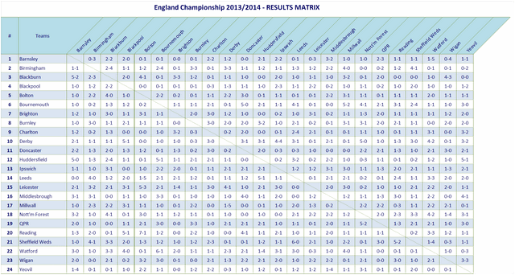

<div align="center">

</div>

<h1 dir="RTL"> 
تمرین سری سوم: از لالیگا تا لیگ برتر
</h1>

> <p dir="RTL"> 
با استفاده از داده های لیگ دسته اول اسپانیا به سوالات زیر پاسخ دهید.
از هر دو ابزار
ggplot2
و
highcharter
برای این کار تصویرسازی استفاده نمایید.
</p>

***

<h2 dir="RTL"> 
کارهای اولیه
</h2>

```{r 0, message=FALSE, warning=FALSE}
library(engsoccerdata)
library(dplyr)
library(highcharter)
library(ggplot2)
library(ggthemes)
library(tidyr)
library(knitr)
library(kableExtra)
library(captioner)
library(scales)

theme_set(theme_gdocs())

tbls <- captioner(prefix="Table")

data = as.tbl(spain) %>% filter(tier == 1, round == "league") %>% select(-tier)

resultByGD = function(GD) {
  result = rep("W", length(GD))
  result[which(GD < 0)] = rep("L", sum(GD < 0))
  result[which(GD == 0)] = rep("D", sum(GD == 0))
  return(result)
}

homeStat = data %>%
  rename(team = home,
         opp = visitor,
         GF = hgoal,
         GA = vgoal) %>%
  mutate(GD = GF - GA) %>%
  mutate(result = resultByGD(GD))

visitorStat = data %>%
  rename(team = visitor,
         opp = home,
         GF = vgoal,
         GA = hgoal) %>%
  mutate(GD = GF - GA) %>%
  mutate(result = resultByGD(GD))

stat = union(homeStat, visitorStat)
```


<p dir="RTL">
۱. تعداد قهرمانی های تیم ها در تاریخ لالیگا  را استخراج کرده و نمودار ستونی آنها را رسم کنید.
</p>


```{r 1, message=FALSE, warning=FALSE, fig.align='center'}
seasonResults = stat %>% group_by(Season, team) %>%
  summarise(
    W = sum(GD > 0),
    L = sum(GD < 0),
    D = sum(GD == 0),
    GD = sum(GD)
  ) %>%
  mutate(Pts = W * 3 + D) %>%
  arrange(-Season, -Pts, -GD) %>%
  group_by(Season) %>%
  mutate(rank = row_number(-Pts))

championStat = seasonResults %>% group_by(team) %>%
  summarise(championships = sum(rank == 1)) %>%
  filter(championships > 0) %>%
  arrange(desc(championships))
hchart(championStat,
       type = 'bar',
       hcaes(x = team, y = championships),
       name = "championships") %>% 
  hc_title(text = "La Liga Champions") %>% 
  hc_xAxis(title = list(enabled = FALSE),
           tickInterval = 5) %>% 
  hc_yAxis(title = list(text = "Championships"))
ggplot(championStat, aes(x = reorder(team, championships), y = championships)) +
  geom_bar(stat = "identity", fill = "dodgerblue4") +
  labs(x = "", y = "Championships", title = "La Liga Champions") +
  coord_flip()
```


***

<p dir="RTL">
۲. کسل کننده ترین لیگ و تیم را بیابید.
نمودار ده تیم و ده فصل کسل کننده را رسم کنید.
</p>


<p dir="RTL">
میزان جذابیت یک بازی را تعداد گل های آن در نظر می گیریم. بر همین اساس حذابیت یک تیم یا یک فصل  را میانگین تعداد گل ها در بازی هایش تعریف می کنیم.
</p>


```{r 2, message=FALSE, warning=FALSE, fig.align='center'}
boringTeams = stat %>%
  group_by(team) %>%
  summarise(goals = sum(GF + GA),
            games = n()) %>%
  mutate(avgGoals = round(goals / games, 2)) %>%
  arrange(avgGoals) %>%
  slice(1:10)
kable(boringTeams[1,], caption = "Most Boring Team")
hchart(boringTeams,
       type = 'column',
       hcaes(x = team, y = avgGoals),
       name = "average goals per game")%>% 
  hc_title(text = "Most Boring Teams") %>% 
  hc_yAxis(title = list(text = "Average Goals Happend in Games")) %>% 
  hc_xAxis(title = list(enabled = FALSE)) 
ggplot(boringTeams, aes(x = reorder(team, -avgGoals), y = avgGoals)) +
  geom_bar(stat = "identity", fill = "dodgerblue4") +
  labs(x = "", y = "Average Goals Happend in Games", title = "Most Boring Teams") +
  coord_flip()

#Most Boring Seasons
boringSeasons = stat %>%
  group_by(Season) %>%
  summarise(goals = sum(GF),
            games = n() / 2) %>%
  mutate(avgGoals = round(goals / games, 2)) %>%
  arrange(avgGoals) %>%
  slice(1:10)
kable(boringSeasons[1,], caption = "Most Boring Season")
hchart(boringSeasons,
       type = 'column',
       hcaes(x = as.factor(Season), y = avgGoals),
       name = "average goals per game")%>% 
  hc_title(text = "Most Boring Seasons") %>% 
  hc_yAxis(title = list(text = "Average Goals Happend in Games")) %>% 
  hc_xAxis(title = list(text = "Season")) 
ggplot(boringSeasons, aes(x = reorder(Season, -avgGoals), y = avgGoals)) +
  geom_bar(stat = "identity", fill = "dodgerblue4") +
  labs(x = "", y = "Average Goals Happend in Games", title = "Most Boring Seasons") +
  coord_flip()
```


***

<p dir="RTL">
۳. در چند درصد موارد قهرمان نیم فصل در پایان فصل قهرمان شده است؟
</p>


<p dir="RTL">
مطابق کد زیر در 52.32558 درصد موارد قهرمان، قهرمان نیم فصل هم بوده است.
</p>

```{r 3, message=FALSE, warning=FALSE, fig.align='center'}
stat = stat %>%
  arrange(Date) %>%
  group_by(Season, team, opp) %>%
  mutate(halfSeason = row_number())
halfSeasonResults = stat %>%
  filter(halfSeason == 1) %>%
  group_by(Season, team) %>%
  summarise(
    W = sum(GD > 0),
    L = sum(GD < 0),
    D = sum(GD == 0),
    GD = sum(GD)
  ) %>%
  mutate(Pts = W * 3 + D) %>%
  arrange(-Season, -Pts, -GD) %>%
  group_by(Season) %>%
  mutate(rank = row_number(-Pts))

seasonChampions = full_join(
  seasonResults %>%
    filter(rank == 1) %>%
    select(Season, Champion = team),
  halfSeasonResults %>%
    filter(rank == 1) %>%
    select(Season, halfSeasonChampion = team),
  by = "Season"
)
sum(seasonChampions$Champion == seasonChampions$halfSeasonChampion) / nrow(seasonChampions) * 100


true = sum(seasonChampions$Champion == seasonChampions$halfSeasonChampion)
false = sum(seasonChampions$Champion != seasonChampions$halfSeasonChampion)
halfChampStat <- data.frame(result = c('True', 'False'), count = c(true, false))
halfChampStat %>%
  hchart(type = "pie", hcaes(x = result, y = count)) %>% 
  hc_title(text = 'Half Season Champion = Champion')

ggplot(halfChampStat, aes(x = "", y = count)) +
  geom_bar(aes(fill = result), stat = 'identity') +
  coord_polar("y", start=0) +
  theme_minimal()+
  theme(
    axis.title.x = element_blank(),
    axis.title.y = element_blank(),
    panel.border = element_blank(),
    panel.grid=element_blank(),
    axis.ticks = element_blank(),
    axis.text.x=element_blank()) +
  labs(x = "", y = "", title = 'Half Season Champion = Champion', fill = "")

```


***
<p dir="RTL">
۴. در بین سال های ۲۰۰۱ تا ۲۰۱۰ گربه سیاه تیم های بزرگ چه تیم هایی بوده است؟
</p>
<p dir="RTL">
۷ تیمی که بیشترین میانگین امتیاز در بازی را داشته اند را تیم های بزرگ در نظر می گیریم. گربه سیاه یک تیم بزرگ تیمی است که تیم بزرگ در برابر آن بیشترین درصد باخت را دارد و یک تیم بزرگ نیست. در صورتی که تساوی رخ دهد، تیمی که در مجموع تفاضل گل بهتری در برابر تیم بزرگ داشته است گربه سیاه است.
</p>
```{r 4, message=FALSE, warning=FALSE, fig.align='center'}
bigTeams = stat %>%
  group_by(team) %>%
  summarise(score = 3 * sum(GD > 0) + sum(GD == 0),
            games = n()) %>%
  mutate(avgScore = score / games) %>%
  arrange(-avgScore) %>%
  slice(1:7) %>%
  .$team

blackCats = stat %>% 
  filter(Season >= 2001, Season <= 2010, team %in% bigTeams, !(opp %in% bigTeams)) %>% 
  group_by(team, opp) %>% 
  summarise(loseRate = sum(GD < 0) / n(), GD = sum(GD)) %>% 
  arrange(-loseRate, GD) %>% 
  group_by(team) %>% 
  summarise(blackCat = first(opp), loseRate = first(loseRate), GD = first(GD))
kable(blackCats, caption = tbls(name="blackCats","Big Teams Black Cats"))
```


***

<p dir="RTL">
۵. در تاریخ لالیگا کدام تیم رکورددار زودترین قهرمانی است؟
همچنین کدام تیم مقتدرانه ترین قهرمانی را داشته است؟
</p>


```{r 5A, message=FALSE, warning=FALSE, fig.align='center'}
stat = stat %>%
  mutate(gainedScore = 3 * (GD > 0) + (GD == 0)) %>%
  arrange(Date) %>%
  group_by(Season, team) %>%
  mutate(
    currentScore = cumsum(gainedScore),
    currentGD = cumsum(GD),
    week = row_number(),
    remainingGames = n() - week
  ) %>%
  arrange(-Season, -week, -currentScore, -currentGD) %>%
  group_by(Season, week) %>%
  mutate(currentRank = row_number())


weekResults = stat %>%
  select(Season, Date, week, team, remainingGames, currentScore, currentRank) %>%
  arrange(-Season, -week, currentRank) %>%
  group_by(Season, week) %>%
  mutate(
    startDate = min(Date),
    top3Dist = lag(lag(lag(currentScore))) - currentScore,
    botDist = currentScore - lead(currentScore)
  ) %>% 
  select(-Date)

fastestChampionships = weekResults %>%
  filter(currentRank == 1, botDist > 3 * remainingGames) %>%
  group_by(Season) %>%
  top_n(n = 1, -week) %>%
  ungroup() %>%
  arrange(-remainingGames)  %>%
  select(-startDate, -top3Dist, -currentRank) %>%
  rename(score = currentScore, dist = botDist)

kable(fastestChampionships %>% top_n(n = 1, remainingGames),
      caption = tbls(name="fastestChampionships","Fastest Championships"))

fastest10Championships = fastestChampionships %>% slice(1:10)

hchart(fastest10Championships,
       type = 'bar',
       hcaes(x = paste(team, '(', Season, ')'), color = team, y = remainingGames),
       name = "remaining games") %>%
  hc_title(text = "Fastest Championships") %>%
  hc_xAxis(title = list(enabled = FALSE),
           tickInterval = 1) %>%
  hc_yAxis(title = list(text = "Remaining Games"))

ggplot(fastest10Championships, aes(x = reorder(paste(team, '(', Season, ')'), remainingGames), y = remainingGames)) +
  geom_bar(aes(fill = team), stat = "identity") +
  labs(x = "", y = "Remaining Games", title = "Fastest Championships") +
  coord_flip() +
  guides(fill = F)
```

<p dir="RTL">
میزان اقتدار یک قهرمانی را نسبت امتیاز قهرمان به امتیاز تیم دوم در نظر می گیریم.
</p>

```{r 5B, message=FALSE, warning=FALSE, fig.align='center'}
bestChampionships = weekResults %>%
  ungroup() %>%
  filter(remainingGames == 0, currentRank == 1) %>%
  mutate(distRatio = currentScore / (currentScore - botDist)) %>%
  arrange(-distRatio) %>%
  select(-startDate, -top3Dist, -currentRank, -remainingGames) %>%
  rename(score = currentScore, dist = botDist)

kable(bestChampionships %>% top_n(n = 5, wt = distRatio),
      caption = tbls(name="bestChampionships","Best Championships"))

best10Championships = bestChampionships %>% slice(1:10)

hchart(best10Championships,
       type = 'bar',
       hcaes(x = paste(team, '(', Season, ')'), color = team, y = distRatio),
       name = "Distance Ratio") %>%
  hc_title(text = "Fastest Championships") %>%
  hc_xAxis(title = list(enabled = FALSE)) %>%
  hc_yAxis(title = list(text = "Distance Ratio"))

ggplot(best10Championships, aes(x = reorder(paste(team, '(', Season, ')'), distRatio), y = distRatio)) +
  geom_bar(aes(fill = team), stat = "identity") +
  labs(x = "", y = "Distance Ratio", title = "Best Championships") +
  coord_flip() +
  guides(fill = F)

```


***

<p dir="RTL">
۶. طولانی ترین نوار پیروزی مساوی و شکست مال چه تیم هایی است؟
</p>


```{r 6, message=FALSE, warning=FALSE, fig.align='center'}
streak = function(results) {
  isChanged = results != lag(results)
  isChanged[1] = FALSE
  streakNo = cumsum(isChanged)
  streak = data_frame(streakNo) %>% 
    group_by(streakNo) %>% 
    mutate(streak = row_number()) %>% 
    .$streak
  return(streak)
}

stat = stat %>%
  arrange(Season, week) %>% 
  group_by(team) %>% 
  mutate(streak = streak(result))
```

<p dir="RTL">
طولانی ترین نوار برد به طور مشترک برای بارسلونا و رئال مادرید و به طول ۱۶ بوده است:
</p>

```{r 6A, message=FALSE, warning=FALSE, fig.align='center'}
winStreak = stat %>%
  filter(result == "W") %>% 
  ungroup() %>% 
  top_n(n = 1, wt = streak) %>% 
  select(team, length = streak, EndDate = Date, EndOpp = opp, EndFTResult = FT)
kable(winStreak, caption = tbls(name="winStreak","Longest Win Streak"))
```

<p dir="RTL">
طولانی ترین نوار باخت برای UD Las Palmas و به طول ۱۱ بوده است:
</p>

```{r 6B, message=FALSE, warning=FALSE, fig.align='center'}
loseStreak = stat %>%
  filter(result == "L") %>% 
  ungroup() %>% 
  top_n(n = 1, wt = streak) %>% 
  select(team, length = streak, EndDate = Date, EndOpp = opp, EndFTResult = FT)
kable(loseStreak, caption = tbls(name="loseStreak","Longest Lose Streak"))
```

<p dir="RTL">
طولانی ترین نوار مساوی برای Burgos CF  و به طول ۹ بوده است:
</p>

```{r 6C, message=FALSE, warning=FALSE, fig.align='center'}
drawStreak = stat %>%
  filter(result == "D") %>% 
  ungroup() %>% 
  top_n(n = 1, wt = streak) %>% 
  select(team, length = streak, EndDate = Date, EndOpp = opp, EndFTResult = FT)
kable(drawStreak, caption = tbls(name="drawStreak","Longest Draw Streak"))
```


***

<p dir="RTL">
۷. زودترین سقوط مال کدام تیم بوده است؟
</p>

<p dir="RTL">
فرض می کنیم هر فصل سه تیم سقوط می کنند. سقوط هایی که هنگام قطعی شدن آن ها بازی های بیشتری از فصل مانده است را پیدا می کنیم. 
</p>

```{r 7A, message=FALSE, warning=FALSE, fig.align='center'}
fastestFalls = weekResults %>%
  group_by(Season) %>%
  filter(currentRank == max(currentRank),
         top3Dist > 3 * remainingGames) %>%
  top_n(n = 1, -week) %>%
  ungroup() %>%
  arrange(-remainingGames)  %>%
  select(-startDate, -botDist, -currentRank) %>%
  rename(score = currentScore, dist = top3Dist)

kable(fastestFalls %>% top_n(n = 1, remainingGames),
      caption = tbls(name="fastestFalls","Fastest Falls"))
```

```{r 7B, message=FALSE, warning=FALSE, fig.align='center'}
fastest10Falls = fastestFalls %>% slice(1:10)
hchart(fastest10Falls,
       type = 'bar',
       hcaes(x = paste(team, '(', Season, ')'), color = team, y = remainingGames),
       name = "remaining games") %>%
  hc_title(text = "Fastest Falls") %>%
  hc_xAxis(title = list(enabled = FALSE),
           tickInterval = 1) %>%
  hc_yAxis(title = list(text = "Remaining Games"))

ggplot(fastest10Falls, aes(x = reorder(paste(team, '(', Season, ')'), remainingGames), y = remainingGames)) +
  geom_bar(aes(fill = team), stat = "identity") +
  labs(x = "", y = "Remaining Games", title = "Fastest Falls") +
  coord_flip() +
  guides(fill = F)
```


***

<div align="center">

</div>

<p dir="RTL">
مانند شکل بالا تصویری از روند تغییر رتبه تیم ها در طول فصل ۱۹۹۸ رسم نمایید.
</p>


```{r 8, message=FALSE, warning=FALSE, fig.align='center', fig.width=10}
ranking = seasonResults %>% 
  filter(Season == 1998) %>% 
  .$team

season1998 <- weekResults %>%
  filter(Season == 1998) 
season1998 %>%
  hchart(type = "line", hcaes(x = startDate, y = currentRank, group = team)) %>%
  hc_xAxis(title = list(enabled = FALSE),
           tickInterval = 1,
           type = 'datetime',
           labels = list(rotation = -45,
                         format = '{value:%b %e}')) %>%
  hc_yAxis_multiples(
    list(
      title = list(text = "Position"),
      reversed = TRUE,
      min = 1,
      max = 20,
      tickInterval = 1
    )
  )

dateBreaks = seq.Date(from = min(season1998$startDate),
                  to = max(season1998$startDate),
                  by = 'week')

season1998 %>%
  ggplot(aes(
    x = startDate,
    y = currentRank,
    group = team,
    color = team
  )) +
  scale_x_date(breaks = dateBreaks, labels = date_format("%b %d")) +
  scale_y_reverse(breaks = 1:20) +
  geom_line() +
  # guides(color = F) +
  labs(x = "", y = "Position") +
  theme(panel.grid.major.x=element_blank(), 
        panel.grid.minor.x=element_blank(), 
        axis.text.x = element_text(angle=45, size = 7, hjust = 1,vjust=1),
        legend.position = 'bottom',
        legend.direction = "horizontal",
        legend.title = element_blank())
```


***

<div align="center">

</div>

<p dir="RTL">
۹. جدولی مشابه بالا برای فصل ۲۰۱۲ از  کل نتایج طراحی کنید.
</p>

<p dir="RTL">
با استفاده از پکیج tidyr می توانیم به data frame ی به شکل خواسته شده برسیم. که در زیر می بینید:
</p>

```{r 9A, message=FALSE, warning=FALSE, fig.align='center'}
#Q9
resultTable = homeStat %>%
  filter(Season == 2012) %>%
  select(team, opp, FT) %>%
  spread(opp, FT)

kable(resultTable, "html") %>%
  kable_styling('striped', full_width = TRUE) %>%
  scroll_box(width = "800px", height = "600px")
```

<p dir="RTL">
اما برای ساخت تصویری مانند آنچه خواسته شده از ggplot استفاده می کنیم:
</p>

```{r 9B, message=FALSE, warning=FALSE, fig.align='center', fig.width = 10, fig.height=6}
teams = visitorStat %>%
  filter(Season == 2012) %>%
  select(opp) %>%
  unique() %>%
  .$opp

season2012 = bind_rows(
    visitorStat %>%
    filter(Season == 2012),
    data.frame(team = teams, opp = teams, FT = rep("", length(teams)))
  ) %>% 
  arrange(opp)

season2012$team = as.factor(season2012$team)
season2012$opp = as.factor(season2012$opp)
ggplot(season2012, aes(team, opp)) + 
  geom_tile(aes(fill = as.numeric(opp) %% 2)) + 
  geom_text(aes(label = FT)) + 
  geom_abline(slope = -1, intercept = 21) +
  scale_fill_gradient2(low = "white", 
                       high = "lightblue1", 
                       midpoint = 0.5) +
  theme(panel.grid.major.x=element_blank(), 
        panel.grid.minor.x=element_blank(), 
        panel.grid.major.y=element_blank(), 
        panel.grid.minor.y=element_blank(),
        panel.background=element_rect(fill="white"), 
        axis.text.x = element_text(angle=45, hjust = 0,vjust=0,size = 12),
        plot.title = element_text(size=20),
        axis.text.y = element_text(size = 12)) + 
  theme(legend.title=element_text(size=14)) + 
  scale_x_discrete(name="", position = 'top') +
  scale_y_discrete(name="", limits = rev(levels(season2012$opp))) +
  guides(fill = FALSE) +
  theme(plot.margin = unit(c(1, 3, 0.5, 0.5), "lines"))
```


***
<p dir="RTL">
۱۰. سه آماره به همراه نمودار فردوسی پسند استخراج کنید.
</p>
<p dir="RTL">
در دوره های ۵ ساله، برای هر دوره، مجموع تفاضل گل بارسلونا در ال کلاسیکو ها را استخراج می کنیم و بهترین خط را از آن می گذارنیم. می بینیم که در طی زمان وضعیت بارسلونا در برابر رئال مادرید بهتر شده است!
</p>
```{r 10A, message=FALSE, warning=FALSE, fig.align='center'}
elClassico = stat %>%
  filter(team == "FC Barcelona", opp == "Real Madrid") %>%
  mutate(period = round(Season / 5) * 5) %>%
  group_by(period) %>%
  summarise(GD = sum(GD), result = resultByGD(GD))

ggplot(elClassico, aes(x = period, y = GD)) +
  geom_rect(aes(
    xmin = min(period) - 5,
    xmax = max(period) + 5,
    ymax = max(GD) + 3
  ), ymin = 0,
  alpha = 0.01, fill = "#a50044") +
  geom_rect(aes(
    xmin = min(period) - 5,
    xmax = max(period) + 5,
    ymin = min(GD) - 3
  ), ymax = 0,
  alpha = 0.01, fill = "dodgerblue") +
  geom_line(color = "White") +
  geom_smooth(method = "lm", se = FALSE, color = "green") +
  scale_color_continuous(low = "yellow", high = "#a50044") +
  guides(color = F) +
  labs(x = 'year', y = 'Total Goal Difference', title = "El Classico Goal Difference for Barcelona" )

m = lm(elClassico$GD~elClassico$period)
hchart(elClassico,
       type = "line",
       hcaes(x = period, y = GD),
       name = "Goal", color = "white", zIndex = 10) %>%
  hc_add_series(
    type = "area",
    data.frame(period = c(1920, 2020), GD = c(20, 20)),
    hcaes(x = period, y = GD),
    color = "white",
    fillColor = "rgba(165, 0, 68, 0.2)",
    enableMouseTracking = FALSE
  ) %>%
  hc_add_series(
    type = "area",
    data.frame(period = c(1920, 2020), GD = c(-20, -20)),
    hcaes(x = period, y = GD),
    color = "white",
    fillColor = "rgba(30, 144, 255, 0.2)",
    enableMouseTracking = FALSE
  ) %>% 
  hc_add_series(
    type = "line",
    data.frame(period = c(1920, 2020), GD = c(-8.75, 7.28)),
    hcaes(x = period, y = GD),
    color = "green",
    enableMouseTracking = FALSE
  ) %>% 
  hc_xAxis(title = list(text = "year")) %>% 
  hc_yAxis(title = list(text = "Total Goal Difference")) %>% 
  hc_title(text = "El Classico Goal Difference for Barcelona")

```
<p dir="RTL">
از داده ی HT نتیجه ی نیمه ی اول را استخراج می کنیم. برای هر تیم نسبت بازی هایی که در نیمه اول برده اند و را در نهایت باخته اند را به کل بازی  هایشان استخراج می کنیم. تیم هایی که بیشترین نسبت را دارند را در نمودار زیر می بینید. جالب است که یک تیم در یک سوم مواقع نیمه ی اول را برده ولی در نهایت باخته است.
</p>

```{r 10B, message=FALSE, warning=FALSE, fig.align='center'}

halfTime = strsplit(stat$HT, "-")
halfTime = t(as.data.frame(halfTime))
stat$hGF = as.integer(halfTime[,1])
stat$hGA = as.integer(halfTime[,2])

stat = stat %>%
  mutate(hGD = hGF - hGA) 

secondHalfLosers = stat %>% 
  group_by(team) %>% 
  summarise(count = sum(!is.na(HT)), changes = sum((hGF > hGA) & (GF < GA))) %>% 
  mutate(perc = changes / count) %>% 
  arrange(-perc) %>% 
  slice(1:10)

hchart(secondHalfLosers, type = 'bar', hcaes(x = team, y = perc))%>% 
  hc_xAxis(title = list(enabled = F)) %>% 
  hc_yAxis(title = list(text = "Game Drop Ratio")) %>% 
  hc_title(text = "Teams with highest second half loss rate")

ggplot(secondHalfLosers, aes(x = reorder(team, perc), y = perc)) + 
  geom_bar(stat = 'identity', fill = 'dodgerblue4') +
  coord_flip() +
  labs(x = "", y = "Game Drop Ratio", title = "Teams with highest second half loss rate")
```
<p dir="RTL">
یکی از دلایل خاطرانگیز بودن یک فصل معلوم نبودن قهرمان تا آخرین بازی ها است. برای هر فصل تعداد تیم هایی که شانس قهرمانی تا قبل از دو بازی آخر را دارند را می شماریم. در۲ فصل ۶ تیم تا آن موقع شانس قهرمانی داشته اند! فصل های با بیشترین تعداد کاندیداهای قهرمانی به شرح زیر هستند:
</p>
```{r 10C, message=FALSE, warning=FALSE, fig.align='center'}


possibleChampions = weekResults %>% 
  filter(remainingGames == 2) %>% 
  group_by(Season) %>% 
  filter(currentScore >= max(currentScore) - 6) %>% 
  summarise(possibleChampions = n()) %>% 
  top_n(n = 5, wt = possibleChampions) %>% 
  arrange(-possibleChampions)
  
hchart(possibleChampions, type = 'bar', hcaes(x = as.factor(Season), y = possibleChampions))%>% 
  hc_xAxis(title = list(enabled = F)) %>% 
  hc_yAxis(title = list(text = "Number of Possible Champions")) %>% 
  hc_title(text = "Seasons with Highest Possible Champions")

ggplot(possibleChampions, aes(x = reorder(Season, possibleChampions), y = possibleChampions)) + 
  geom_bar(stat = 'identity', fill = 'dodgerblue') +
  coord_flip() +
  labs(x = "", y = "Number of Possible Champions", title = "Seasons with Highest Possible Champions")  


```
