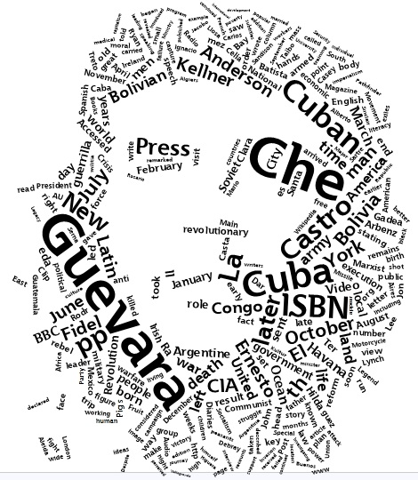
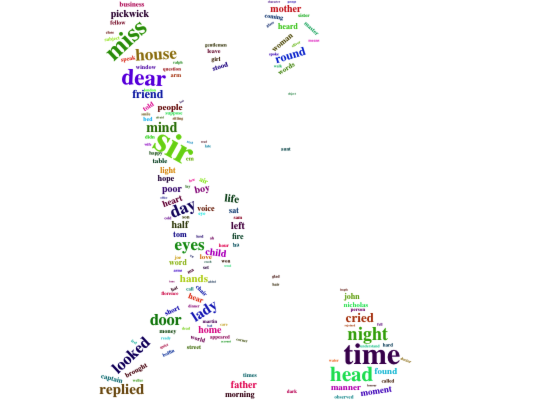

<div align="center">

</div>

> <p dir="RTL"> 
با استفاده از بسته gutenberg داده های لازم را به دست آورید و به سوالات زیر پاسخ دهید.
</p>

***

<p dir="RTL">
کارهای اولیه
</p>

```{r pre, message=FALSE, warning=FALSE, fig.align='center'}
library(gutenbergr)
library(stringr)
library(tidytext)
library(dplyr)
library(tidyr)
library(ggplot2)
library(ggthemes)
library(scales)
library(highcharter)
theme_set(theme_gdocs())
```

<p dir="RTL">
۱. چارلز دیکنز نویسنده معروف انگلیسی بالغ بر چهارده رمان (چهارده و نیم) نوشته است. متن تمامی کتاب های او را دانلود کنید و سپس بیست لغت برتر استفاده شده را به صورت یک نمودار ستونی نمایش دهید. (طبیعتا باید ابتدا متن را پاکسازی کرده و stopping words را حذف نمایید تا به کلماتی که بار معنایی مشخصی منتقل می کنند برسید.)
</p>

```{r 1, message=FALSE, warning=FALSE, fig.align='center'}
bookCodes = c(580, 730, 967, 700, 917, 968, 821, 766, 1023, 786, 963, 1400, 883, 564)
# View(gutenberg_metadata %>% filter(gutenberg_id %in% novelCodes))
# books = gutenberg_download(bookCodes)
# saveRDS(books, file="books.Rda")
books = readRDS(file="books.Rda")

words = books$text %>% 
  str_replace_all("[[:punct:]]", " ") %>% 
  str_replace_all("\"", " ") %>% 
  str_split_fixed("[\\s]", n = Inf) %>% 
  as.data.frame(stringsAsFactors = F)
colnames(words) = 1:72
words = cbind(books, words) %>% 
  select(-text) %>% 
  mutate(line = row_number()) %>% 
  gather(key = 'index', value = 'word', 2:73) %>% 
  mutate(index = as.numeric(index)) %>% 
  arrange(line, index) %>% 
  select(-line, -index) %>% 
  filter(str_length(word) > 1)


wordFreq = words$word %>% 
  str_to_lower() %>% 
  table() %>% 
  as.data.frame(stringsAsFactors = F)
colnames(wordFreq) = c('word', 'count')
aux <- c('don', 'll', 'isn', 'aren', 're', 'wouldn', 'couldn')
wordFreq = wordFreq %>% 
  filter(!str_to_lower(word) %in% stop_words$word) %>% 
  filter(!word %in% aux) %>% 
  arrange(desc(count))

topWords = wordFreq %>% 
  top_n(n = 20, count)


hchart(topWords, type = 'column', hcaes(x = word, y = count), name = 'Count')
```

***

<p dir="RTL">
۲. ابر لغات ۲۰۰ کلمه پرتکرار در رمان های چارلز دیکنز را رسم نمایید. این کار را با بسته wordcloud2 انجام دهید. برای دانلود می توانید به لینک زیر مراجعه کنید.
</p>

https://github.com/Lchiffon/wordcloud2

<p dir="RTL">
 با استفاده از عکسی که در ابتدا متن آمده ابر لغاتی مانند شکل زیر رسم کنید. (راهنمایی: از ورودی figpath در دستور wordcloud2 استفاده نمایید.مثالی در زیر آورده شده است.)
</p>

<div align="center">

</div>


```{r 2, message=FALSE, warning=FALSE, fig.align='center'}
topWords = wordFreq %>% 
  top_n(n = 200, count)
library(wordcloud2)
wordcloud2(topWords)
wordcloud2(topWords, figPath = 'fig.png', size = 0.2)
```

<div align="center">

</div>

***

<p dir="RTL">
۳. اسم پنج شخصیت اصلی در هر رمان دیکنز را استخراج کنید و با نموداری تعداد دفعات تکرار شده بر حسب رمان را رسم نمایید. (مانند مثال کلاس در رسم اسامی شخصیت ها در سری هر پاتر)
</p>

<p dir="RTL">
کلماتی که با حروف کوچک آن ها موجود نیست را به عنوان اسم شناسایی می کنیم
</p>

```{r 3, message=FALSE, warning=FALSE, fig.align='center', fig.height=8, fig.width=10}
wordFreqByBook = words %>% 
  filter(!str_to_lower(word) %in% stop_words$word) %>% 
  filter(!word %in% aux) %>% 
  group_by(gutenberg_id, word) %>% 
  summarise(count = n()) %>% 
  ungroup()
names = wordFreqByBook %>% 
  filter(!str_to_lower(word) %in% stop_words$word) %>% 
  filter(!str_to_lower(word) %in% word) %>% 
  rename(name = word)

names = left_join(names, 
                  gutenberg_metadata %>% select(gutenberg_id, title))

topNames = names %>% 
  group_by(title) %>% 
  top_n(5, count)

  
ggplot(topNames, aes(x = paste(title, str_pad(count, 5, pad = "0"), name), y = count, fill = title)) +
  geom_bar(stat = 'identity') +
  scale_x_discrete(labels = topNames$name) +
  scale_fill_stata() +
  coord_flip() +
  theme(legend.position="bottom", legend.direction = 'horizontal',
        axis.text=element_text(size=7)) +
  labs(x = 'Name', y = 'Count', fill = 'Title')
```

***

<p dir="RTL">
۴.  در بسته tidytext داده ایی به نام sentiments وجود دارد که فضای احساسی لغات را مشخص می نماید. با استفاده از این داده نمودار ۲۰ لغت برتر negative و ۲۰ لغت برتر positive را در کنار هم رسم نمایید. با استفاده از این نمودار فضای حاکم بر داستان چگونه ارزیابی می کنید؟ (به طور مثال برای کتاب داستان دو شهر فضای احساسی داستان به ترتیب تکرر در نمودار زیر قابل مشاهده است.)
</p>

<div align="center">

</div>

<p dir="RTL">
نمودارها را در زیر میبینید. به طور کلی هر چه تعدا کلمات مثبت بیشتر باشد، فضای کتاب مثبت و شادتر است. که براساس نمودارهای زیر به سادگی قابل فهم است. به طور کلی لغات مثبت بیشتر به نظر می آیند.
</p>

```{r 4, message=FALSE, warning=FALSE, fig.align='center'}
nrcPosNeg = sentiments %>% 
  filter(lexicon == 'nrc', sentiment %in% c('negative', 'positive')) %>% 
  select(word, sentiment)

for(code in bookCodes) {
  title = gutenberg_metadata$title[gutenberg_metadata$gutenberg_id == code]
    
  np = wordFreqByBook %>%
    filter(gutenberg_id == code) %>% 
    filter(word %in% nrcPosNeg$word)
  np = left_join(np, nrcPosNeg, by = 'word')
  
  topNP = np %>% 
    group_by(sentiment) %>% 
    top_n(20, count) %>% 
    ungroup() %>% 
    arrange(desc(count)) %>% 
    mutate(index = row_number())
  
  p = ggplot(topNP, aes(x = reorder(word, count), y = count, fill = sentiment)) +
    geom_bar(stat = 'identity', position = 'dodge') +
    facet_grid(.~sentiment, scale = "free") +
    theme(axis.text = element_text(size = 7),
          axis.text.x = element_text(hjust = 1, vjust = 1, angle = 45),
          legend.position="bottom", legend.direction = 'horizontal') +
    labs(x = '', y = 'Count', fill = 'Sentiment',
         title = 'Top Positive and Negative Words', subtitle = paste('in', title))
  print(p)
}

```

***

<p dir="RTL">
۵. متن داستان بینوایان را به ۲۰۰ قسمت مساوی تقسیم کنید. برای هر قسمت تعداد لغات positive و negative را حساب کنید و سپس این دو سری زمانی را در کنار هم برای مشاهده فضای احساسی داستان رسم نمایید.
</p>

<p dir="RTL">
چون تعداد کلماتی که مثبت یا منفی بودنشان معلوم است در قطعات معلوم نیست، برای نرمال کردن، فراوانی را بر کل کلماتی که این موضوع برایشان مشخص است. تقسیم میکنیم
</p>

```{r 5, message=FALSE, warning=FALSE, fig.align='center'}
miserables_id = 135
# miserablesBook = gutenberg_download(miserables_id)
# saveRDS(miserablesBook, file="miserables.Rda")
miserablesBook = readRDS(file="miserables.Rda")
miserablesWords = miserablesBook$text %>% 
  str_replace_all("[[:punct:]]", " ") %>% 
  str_replace_all("\"", " ") %>% 
  str_split("[\\s]+") %>% 
  unlist() %>% 
  as.data.frame(stringsAsFactors = F)
colnames(miserablesWords) = 'word'
miserablesWords = miserablesWords %>% 
  filter(str_length(word) > 0) %>% 
  mutate(part = ceiling(row_number() * 200 / n())) %>% 
  mutate(word = str_to_lower(word))

nrcSentiments = sentiments %>% 
  filter(lexicon == 'nrc') %>% 
  select(word, sentiment)

miserablesWords = inner_join(miserablesWords, nrcPosNeg, by = 'word')

storyMood = miserablesWords %>% 
  group_by(part, sentiment) %>% 
  summarise(count = n()) %>% 
  group_by(part) %>% 
  mutate(prop = 100 * count / sum(count)) %>%

  ungroup()

hchart(storyMood, type = 'line', hcaes(x = part, y = prop, group = sentiment)) %>% 
  hc_colors(colors = c('#e84118', '#4cd137'))

```

***

<p dir="RTL">
۶. ابتدا ترکیبات دوتایی کلماتی که پشت سر هم می آیند را استخراج کنید و سپس نمودار ۳۰ جفت لغت پرتکرار را رسم نمایید.
</p>

```{r 6, message=FALSE, warning=FALSE, fig.align='center'}
filteredPairs = words %>% 
  mutate(word = str_to_lower(word)) %>% 
  rename(word1 = word) %>% 
  mutate(word2 = lead(word1)) %>% 
  filter(!word1 %in% stop_words$word) %>% 
  filter(!word2 %in% stop_words$word)

filteredPairsStat = filteredPairs %>% 
  group_by(word1, word2) %>% 
  summarise(count = n()) %>% 
  arrange(desc(count)) %>% 
  ungroup()

topPairs = filteredPairsStat %>% top_n(30, wt = count)

hchart(topPairs, type = 'bar', hcaes(x = paste(word1, word2), y = count), name = 'Count') %>% 
  hc_xAxis(title = list(text = NA))
```

***

<p dir="RTL">
۷. جفت کلماتی که با she و یا he آغاز می شوند را استخراج کنید. بیست فعل پرتکراری که زنان و مردان در داستان های دیکنز انجام می دهند را استخراج کنید و نمودار آن را رسم نمایید.
</p>

<p dir="RTL">
این کار را انجام می دهیم. نمودار آخر کلمات را برحسب نسبت استفاده سان در بین زنان و مردان نشان میدهد
</p>

```{r 7, message=FALSE, warning=FALSE, fig.align='center'}
pairs = words %>% 
  mutate(word = str_to_lower(word)) %>% 
  rename(word1 = word) %>% 
  mutate(word2 = lead(word1)) %>% 
  filter(!word2 %in% stop_words$word) %>% 
  filter(!word2 %in% aux)

pairStat = pairs %>% 
  group_by(word1, word2) %>% 
  summarise(count = n()) %>% 
  arrange(desc(count)) %>% 
  ungroup()

hePairs = pairStat %>% 
  filter(word1 == 'he') %>% 
  mutate(prop = count / sum(count)) %>% 
  top_n(20, count)

shePairs = pairStat %>% 
  filter(word1 == 'she') %>% 
  mutate(prop = count / sum(count)) %>% 
  top_n(20, count) 

heshePairs = rbind(hePairs, shePairs)

topVerbs = full_join(hePairs %>% select(word2, prop), 
                     shePairs%>% select(word2, prop),
                     by = 'word2') %>% 
  rename(heProp = prop.x, sheProp = prop.y)
topVerbs[is.na(topVerbs)] = 0
topVerbs = topVerbs %>% 
  mutate(ratio = heProp / sheProp)
  
heshePairs = rbind(hePairs, shePairs)
heshePairs = left_join(heshePairs, topVerbs)

hchart(hePairs, type = 'bar', hcaes(x = word2, y = count)) %>% 
  hc_xAxis(title = list(text = "")) %>% 
  hc_title(text = 'Most Common Verbs For Men')
hchart(shePairs, type = 'bar', hcaes(x = word2, y = count)) %>% 
  hc_xAxis(title = list(text = "")) %>% 
  hc_title(text = 'Most Common Verbs For Women')

ggplot(heshePairs, aes(x = reorder(word2, ratio), y = prop, fill = word1)) +
  geom_bar(stat = 'identity', position = 'fill') +
  coord_flip()
```

***

<p dir="RTL">
۸. برای کتاب های دیکنز ابتدا هر فصل را جدا کنید. سپی برای هر فصل 
1-gram, 2-gram
را استخراج کنید. آیا توزیع  N-gram
در کارهای دیکنز یکسان است؟ با رسم نمودار هم این موضوع را بررسی کنید.
</p>

<p dir="RTL">
استخراج برای فصل ها
</p>

```{r 8A, message=FALSE, warning=FALSE, fig.align='center', eval = FALSE}
words = words %>% 
  group_by(gutenberg_id) %>% 
  mutate(chapter = as.numeric(str_detect(str_to_lower(word), 'chapter'))) %>% 
  mutate(chapter = cumsum(chapter))

chaptersText = words %>% 
  filter(chapter > 0) %>% 
  mutate(word = str_to_lower(word)) %>% 
  group_by(gutenberg_id, chapter) %>% 
  summarise(text = paste(word, sep = ' ', collapse = ' '), count = n()) %>% 
  filter(count > 30)

booksText = words %>% 
  mutate(word = str_to_lower(word)) %>% 
  group_by(gutenberg_id) %>% 
  summarise(text = paste(word, sep = ' ', collapse = ' '))


library(ngram)
chaptersNgramStat = list()
for(i in 1:nrow(chaptersText)) {
  text = chaptersText[i,]$text %>% as.character()
  ng1 = ngram(as.character(text), n = 1)
  ng2 = ngram(as.character(text), n = 2)
  s1 <- get.phrasetable(ng1) %>% 
    mutate(n = 1) %>% 
    filter(!str_trim(ngrams) %in% stop_words$word) %>% 
    filter(!str_trim(ngrams) %in% aux)
  s2 <- get.phrasetable(ng2) %>% 
    mutate(n = 2) %>% 
    separate(ngrams, c("word1", "word2"), sep = " ") %>% 
    filter(!word1 %in% stop_words$word) %>%
    filter(!word2 %in% stop_words$word) %>% 
    mutate(ngrams = paste(word1, word2)) %>% 
    select(-word1, -word2)
  summary = rbind(s1,s2)
  summary = summary %>% select(-freq)
  colnames(summary) = c('ngram', 'prop', 'n')
  id = chaptersText[i,]$gutenberg_id
  ch = chaptersText[i,]$chapter
  summary = summary %>% mutate(gutenburg_id = id, chapter = ch)
  chaptersNgramStat[[i]] = summary
}
chaptersNgramStat = plyr::rbind.fill(chaptersNgramStat)
chaptersNgramStat = chaptersNgramStat %>% mutate(author = 'Dickens')
```

<p dir="RTL">
برای بررسی برابری از تست chi squared استفاده می کنیم که نتیجه نشان میدهد یکسان نیستند
</p>


```{r 8B, message=FALSE, warning=FALSE, fig.align='center', eval = FALSE}
ngramStat = data.frame(ngram = character(0), n = numeric(0), stringsAsFactors = F)
for(code in bookCodes) {
  text = booksText %>% filter(gutenberg_id == code) %>% .$text %>% as.character()
  ng1 = ngram(as.character(text), n = 1)
  ng2 = ngram(as.character(text), n = 2)
  s1 <- get.phrasetable(ng1) %>% 
    mutate(n = 1) %>% 
    filter(!str_trim(ngrams) %in% stop_words$word) %>% 
    filter(!str_trim(ngrams) %in% aux)
  s2 <- get.phrasetable(ng2) %>% 
    mutate(n = 2) %>% 
    separate(ngrams, c("word1", "word2"), sep = " ") %>% 
    filter(!word1 %in% stop_words$word) %>%
    filter(!word2 %in% stop_words$word) %>% 
    mutate(ngrams = paste(word1, word2)) %>% 
    select(-word1, -word2)
  summary = rbind(s1,s2)
  summary = summary %>% select(-freq)
  colnames(summary) = c('ngram', code, 'n')
  ngramStat = full_join(ngramStat, summary) %>% distinct()
}
testData <- ngramStat %>% 
             select(-ngram, -n)
testData[is.na(testData)] = 0
testData = testData * 100000000
# chisq.test(testData)
saveRDS(testData, 'booksComparison.rds')
```
```{r 8BE, message=FALSE, warning=FALSE, fig.align='center', echo=FALSE}
chisq.test(readRDS('booksComparison.rds'))
```

<p dir="RTL">
نمودار
</p>


```{r 8C, message=FALSE, warning=FALSE, fig.align='center', eval = FALSE}
ngramStat$total = rowSums(ngramStat %>% select(-ngram, -n))

plotData = ngramStat %>% 
  group_by(n) %>% 
  top_n(5, total) %>% 
  arrange(total) %>% 
  ungroup() %>% 
  gather(key = 'gutenberg_id', value = 'prop', 3:15) %>% 
  mutate(gutenberg_id = as.numeric(gutenberg_id)) %>% 
  left_join(gutenberg_metadata %>% select(gutenberg_id, title))

dickensBooksComparison = hchart(plotData, type = 'column', hcaes(x = ngram, y = prop, group = title))
dickensBooksComparison
saveRDS(dickensBooksComparison, 'dickensBooksComparison.rds')
```
```{r 8CE, message=FALSE, warning=FALSE, fig.align='center', echo=FALSE}
readRDS('dickensBooksComparison.rds')
```

***

<p dir="RTL"> 
۹. برای آثار ارنست همینگوی نیز تمرین ۸ را تکرار کنید. آیا بین آثار توزیع n-grams در بین آثار این دو نویسنده یکسان است؟
</p>

<p dir="RTL">
مشابه ۸
</p>

```{r 9A, message=FALSE, warning=FALSE, fig.align='center', eval = FALSE}
austinsBookCodes = c(105,   121,   141,   158,   161,   946,  1212,  1342)
# austinBooks = gutenberg_download(austinsBookCodes)
# saveRDS(austinBooks, file = "austinBooks.rds")
austinBooks = readRDS(file = "austinBooks.rds")

austinWords = austinBooks$text %>% 
  str_replace_all("[[:punct:]]", " ") %>% 
  str_replace_all("\"", " ") %>% 
  str_split_fixed("[\\s]", n = Inf) %>% 
  as.data.frame(stringsAsFactors = F)
colnames(austinWords) = 1:61
austinWords = cbind(austinBooks, austinWords) %>% 
  select(-text) %>% 
  mutate(line = row_number()) %>% 
  gather(key = 'index', value = 'word', 2:62) %>% 
  mutate(index = as.numeric(index)) %>% 
  arrange(line, index) %>% 
  select(-line, -index) %>% 
  filter(str_length(word) > 1) %>% 
  mutate(word = str_to_lower(word))

austinWords = austinWords %>% 
  group_by(gutenberg_id) %>% 
  mutate(chapter = as.numeric(str_detect(str_to_lower(word), 'chapter'))) %>% 
  mutate(chapter = cumsum(chapter))

austinChaptersText = austinWords %>% 
  filter(chapter > 0) %>% 
  mutate(word = str_to_lower(word)) %>% 
  group_by(gutenberg_id, chapter) %>% 
  summarise(text = paste(word, sep = ' ', collapse = ' '), count = n()) %>% 
  filter(count > 30)

austinChaptersNgramStat = list()
for(i in 1:nrow(austinChaptersText)) {
  text = austinChaptersText[i,]$text %>% as.character()
  ng1 = ngram(as.character(text), n = 1)
  ng2 = ngram(as.character(text), n = 2)
  s1 <- get.phrasetable(ng1) %>% 
    mutate(n = 1) %>% 
    filter(!str_trim(ngrams) %in% stop_words$word) %>% 
    filter(!str_trim(ngrams) %in% aux)
  s2 <- get.phrasetable(ng2) %>% 
    mutate(n = 2) %>% 
    separate(ngrams, c("word1", "word2"), sep = " ") %>% 
    filter(!word1 %in% stop_words$word) %>%
    filter(!word2 %in% stop_words$word) %>% 
    mutate(ngrams = paste(word1, word2)) %>% 
    select(-word1, -word2)
  summary = rbind(s1,s2)
  summary = summary %>% select(-freq)
  colnames(summary) = c('ngram', 'prop', 'n')
  id = austinChaptersText[i,]$gutenberg_id
  ch = austinChaptersText[i,]$chapter
  summary = summary %>% mutate(gutenburg_id = id, chapter = ch)
  austinChaptersNgramStat[[i]] = summary
}
austinChaptersNgramStat = plyr::rbind.fill(austinChaptersNgramStat)
austinChaptersNgramStat = austinChaptersNgramStat %>% mutate(author = 'Austin')
```

<p dir="RTL">
با تست chi squared برابری توزیع را بین دو نویسنده بررسی می کنیم که نتیجه نشان می دهد برابر نیستند
</p>


```{r 9B, message=FALSE, warning=FALSE, fig.align='center', eval = FALSE}

authors <- c('Austin', 'Dickens')
authorsText = data.frame(author = authors,
           text = c(
             paste(austinWords$word, sep = ' ', collapse = ' '),
             paste(str_to_lower(words$word), sep = ' ', collapse = ' ')
           ))


authorsNgramStat = data.frame(ngram = character(0), n = numeric(0), stringsAsFactors = F)
for(a in authors) {
  text = authorsText %>% filter(author == a) %>% .$text %>% as.character()
  ng1 = ngram(as.character(text), n = 1)
  ng2 = ngram(as.character(text), n = 2)
  s1 <- get.phrasetable(ng1) %>% 
    mutate(n = 1) %>% 
    filter(!str_trim(ngrams) %in% stop_words$word) %>% 
    filter(!str_trim(ngrams) %in% aux)
  s2 <- get.phrasetable(ng2) %>% 
    mutate(n = 2) %>% 
    separate(ngrams, c("word1", "word2"), sep = " ") %>% 
    filter(!word1 %in% stop_words$word) %>%
    filter(!word2 %in% stop_words$word) %>% 
    mutate(ngrams = paste(word1, word2)) %>% 
    select(-word1, -word2)
  summary = rbind(s1,s2)
  summary = summary %>% select(-freq)
  colnames(summary) = c('ngram', a, 'n')
  authorsNgramStat = full_join(authorsNgramStat, summary) %>% distinct()
}
testData <- authorsNgramStat %>% 
  select(-ngram, -n)
testData[is.na(testData)] = 0
testData = testData * 1000000

# chisq.test(testData)
saveRDS(testData, 'authorsComparisonTest.rds')
```
```{r 9BE, message=FALSE, warning=FALSE, fig.align='center', echo=FALSE}
chisq.test(readRDS('authorsComparisonTest.rds'))
```

<p dir="RTL">
کارهای اولیه
</p>


```{r 9C, message=FALSE, warning=FALSE, fig.align='center', eval = FALSE}
authorsNgramStat$total = rowSums(authorsNgramStat %>% select(-ngram, -n))

plotData = authorsNgramStat %>% 
  group_by(n) %>% 
  top_n(5, total) %>% 
  arrange(total) %>% 
  ungroup() %>% 
  gather(key = 'author', value = 'prop', 3:4)

authorsComparison = hchart(plotData, type = 'column', hcaes(x = ngram, y = prop, group = author))
authorsComparison
saveRDS(authorsComparison, file = 'authorsComparison.rds')
```
```{r 9CE, message=FALSE, warning=FALSE, fig.align='center', echo=FALSE}
readRDS('authorsComparison.rds')
```

***

<p dir="RTL"> 
۱۰. بر اساس دادهایی که در تمرین ۸ و ۹ از آثار دو نویسنده به دست آوردید و با استفاده از  N-gram ها یک مدل لاجستیک برای تشخیص صاحب اثر بسازید. خطای مدل چقدر است؟ برای یادگیری مدل از کتاب کتاب الیور تویست اثر دیکنز و کتاب پیرمرد و دریا استفاده نکنید. پس از ساختن مدل برای تست کردن فصل های این کتابها را به عنوان داده ورودی به مدل بدهید. خطای تشخیص چقدر است؟
</p>

<p dir="RTL">
۲۰ لغت و ۲۰ جفت لغتی که بیشترین تکرار را در کل داشته اند به عنوان متغیرهای مدل استفاده می کنیم. سپس بهترین مرز را بر اساس داده ی آموزش به دست می آوریم که خظای آن ۹ درصد می شود. این کار را در داده ی تست هم انجام می دهیم و به خطای نزدیک ۳۰ درصد می رسیم.
</p>


```{r 10, message=FALSE, warning=FALSE, fig.align='center', eval = FALSE}
topWords = authorsNgramStat %>% 
  group_by(n) %>% 
  top_n(20, total) %>% 
  arrange(total) %>% 
  .$ngram
bothChaptersNgram = rbind(chaptersNgramStat, austinChaptersNgramStat)
bothChaptersNgram = bothChaptersNgram %>%
  filter(ngram %in% topWords) %>% 
  spread(ngram, prop)
bothChaptersNgram[] = lapply(bothChaptersNgram[], unlist)
bothChaptersNgram[bothChaptersNgram == 'NULL'] = 0
bothChaptersNgram[is.na(bothChaptersNgram)] = 0
bothChaptersNgram[5:ncol(bothChaptersNgram)] = lapply(bothChaptersNgram[5:ncol(bothChaptersNgram)], 
                                                      function(x){x * 10000})
bothChaptersNgram$author = as.numeric(as.factor(bothChaptersNgram$author)) - 1
saveRDS(bothChaptersNgram, 'bothChaptersNgram.rds')
```
```{r 10E, message=FALSE, warning=FALSE, fig.align='center'}
bothChaptersNgram = readRDS('bothChaptersNgram.rds')
train = bothChaptersNgram %>% 
  filter(!gutenburg_id %in% c(158, 730)) %>% 
  select(-gutenburg_id, -n, -chapter) 
test = bothChaptersNgram %>% 
  filter(gutenburg_id %in% c(158, 730)) %>% 
  select(-gutenburg_id, -n, -chapter)

model = glm(
  author ~ .,
  data = train,
  family = 'binomial')
summary(model)

y <- train$author
predict = fitted.values(model)

cutoff = seq(0, 1, 0.001)
acc = sapply(cutoff, function(c) {
  TP <- sum(predict >= c & y == 1)
  TN <- sum(predict < c & y == 0)
  return( (TP + TN) / length(predict))
})

bestIndex <- which.max(acc)
paste('Cutoff:', cutoff[bestIndex],
      'Acc:', acc[bestIndex])

y <- test$author
predict = predict.glm(model, test, type = 'response')
results = data.frame(actual = as.factor(ifelse(y == 0, '0 (Austin)', '1 (Dickens)')), predict)
ggplot(results, aes(x = predict, fill = actual, group = actual)) +
  geom_density()

TP <- sum(predict >= cutoff[bestIndex] & y == 1)
TN <- sum(predict < cutoff[bestIndex] & y == 0)
paste('Error:',1 - (TP + TN) / length(predict))

```


